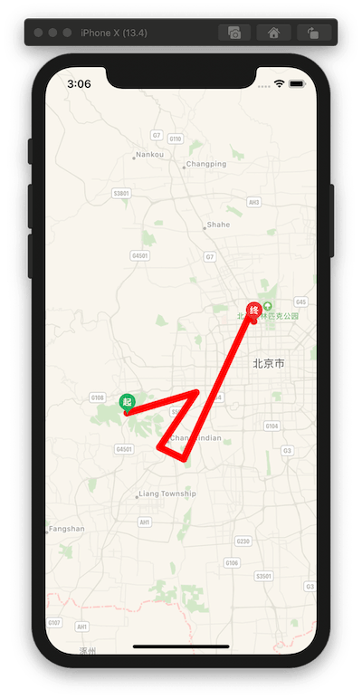

[](https://github.com/Carthage/Carthage)


# TrackMapView

- [Requirements](#requirements)
- [Installation](#installation)
- [Usage](#usage)

## 主要内容的介绍

* `生成轨迹地图`<br>

## Requirements

- Swift 4.2
- iOS 11.0+
- Xcode 11.x

<br>

## Installation

### Carthage

[Carthage](https://github.com/Carthage/Carthage) is a decentralized dependency manager that builds your dependencies and provides you with binary frameworks.

To integrate **TrackMapView** into your Xcode project using Carthage, specify it in your `Cartfile`:

```ogdl
github "chenjie1219/TrackMapView"
```

Run `carthage update` to build the framework and drag the built `TrackMapView.framework` into your Xcode project.

### Manually

Just download the project, and drag and drop the "TrackMapView" folder in your project.

<br>

## Usage

#### 生成轨迹地图

```Swift
let coordinates = [
        CLLocationCoordinate2D(latitude: 39.855539, longitude: 116.119037),
        CLLocationCoordinate2D(latitude: 39.88539, longitude: 116.250285),
        CLLocationCoordinate2D(latitude: 39.805479, longitude: 116.180859),
        CLLocationCoordinate2D(latitude: 39.788467, longitude: 116.226786),
        CLLocationCoordinate2D(latitude: 40.001442, longitude: 116.353915),
        CLLocationCoordinate2D(latitude: 39.989105, longitude: 116.360200)]
        
mapView.drawPolyLine(coordinates: coordinates, color: <#T##UIColor#>, width: <#T##CGFloat#>, startImage: <#T##UIImage?#>, endImage: <#T##UIImage?#>)
```


## 效果图


## Author

* Email:4234115@qq.com

* Wechat:4234115